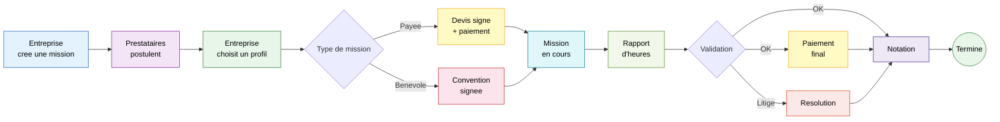
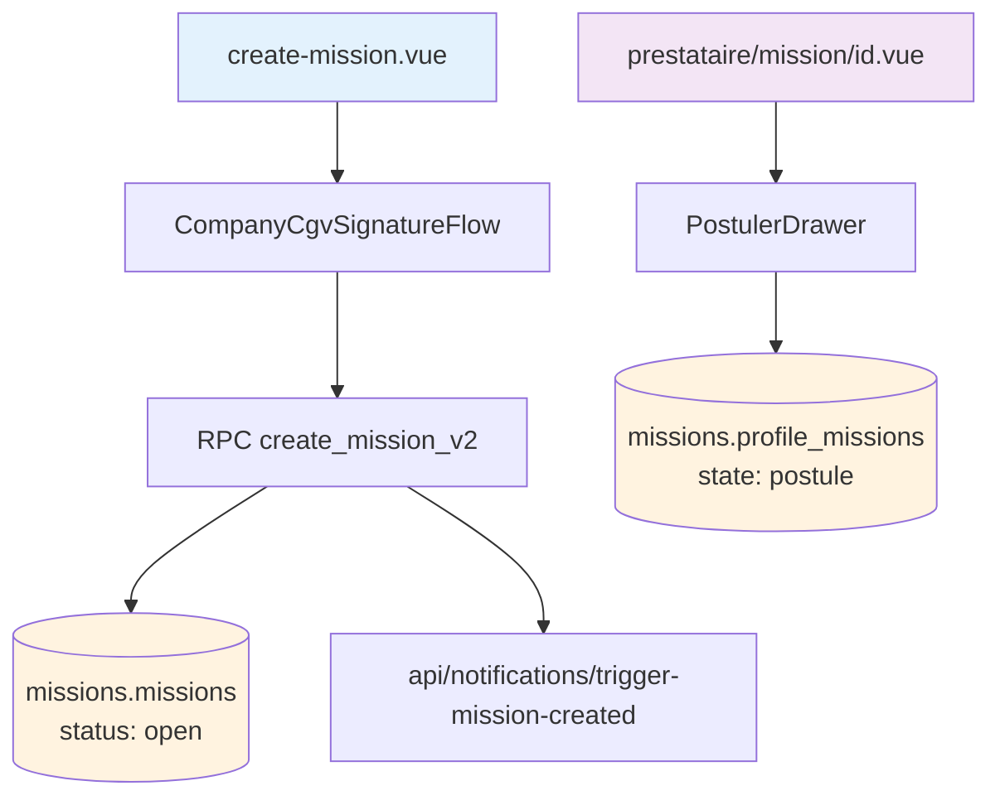
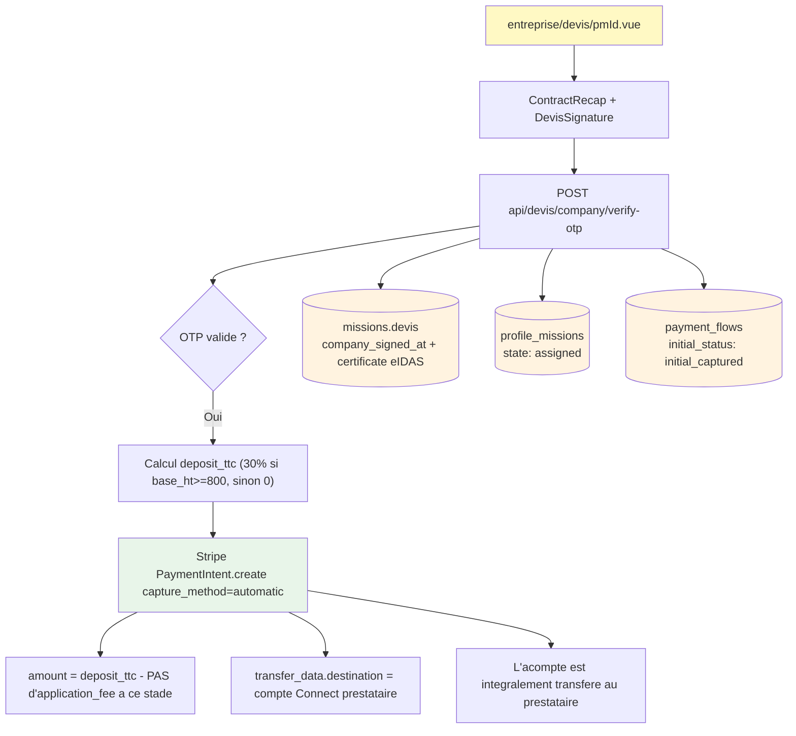
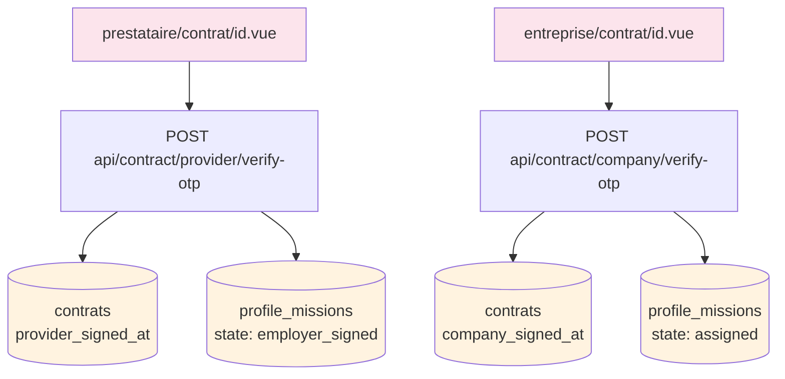
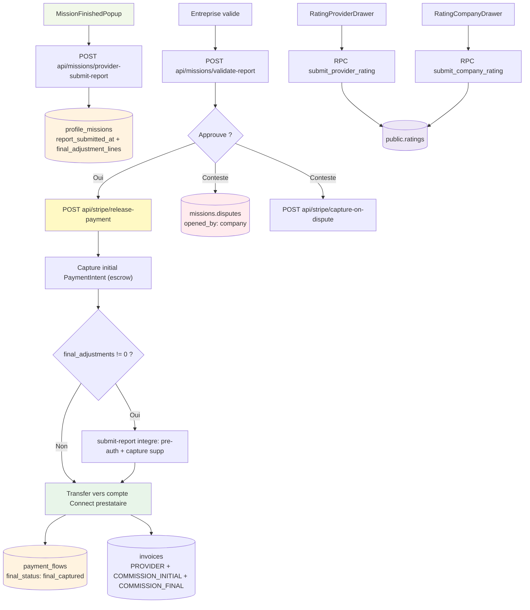
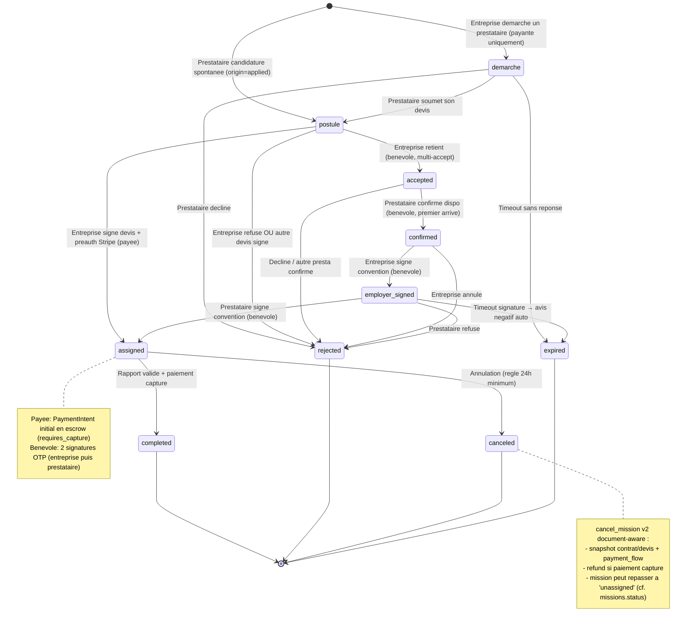
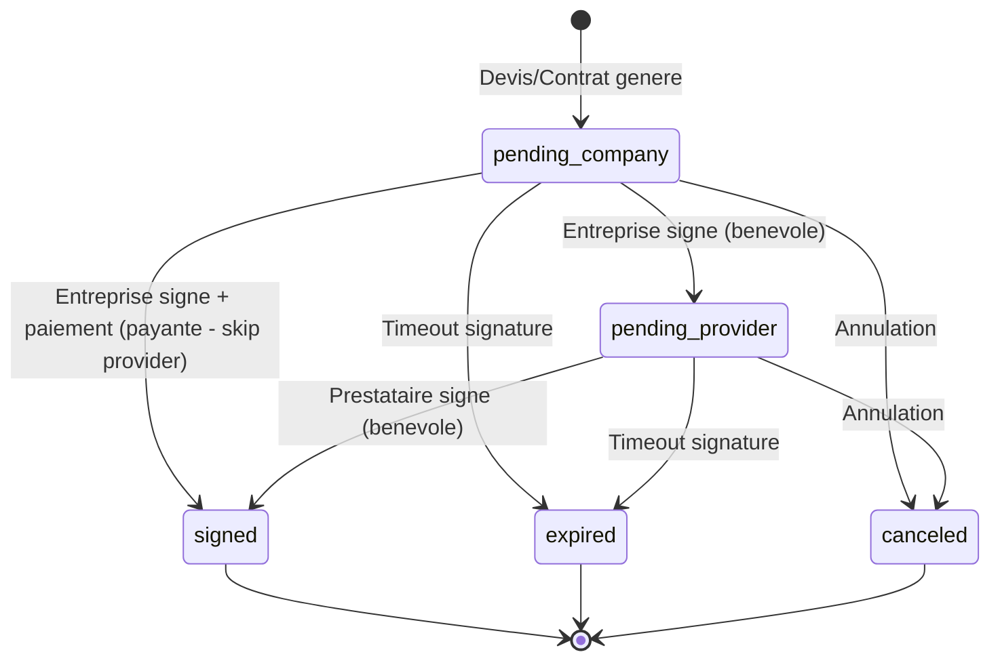
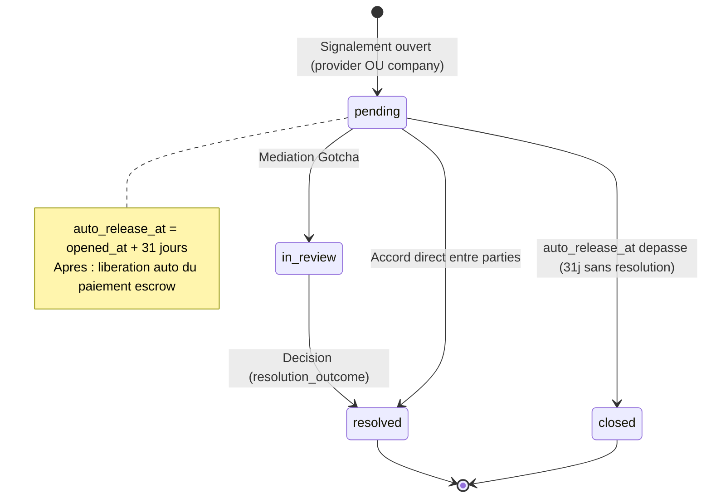

# Parcours Mission Complet

> De la creation de mission au paiement et notation - tous les cas possibles.

## Vue d'ensemble



---

## 1. Schema Fonctionnel

```mermaid
flowchart TD
    subgraph CREATION["CREATION MISSION - Entreprise"]
        A1[Entreprise remplit le formulaire multi-etapes]
        A2{CGV signees ?}
        A3[Modal signature CGV]
        A4[Mission creee - status: open]
        A5[Notifications push aux prestataires matches]

        A1 --> A2
        A2 -- Non --> A3 --> A4
        A2 -- Oui --> A4
        A4 --> A5
    end

    subgraph CANDIDATURE["CANDIDATURE - Prestataire"]
        B1[Prestataire voit la mission]
        B2{Mission benevole ?}

        B3[PostulerDrawer - Payee]
        B3a[1. Dispo + mobilite]
        B3b[2. Objets a apporter]
        B3c[3. Tarif horaire]
        B3d[4. Temps de preparation]
        B3e[5. CGV prestataire]
        B3f[6. Recap devis]

        B4[PostulerDrawer - Benevole]
        B4a[1. Dispo + mobilite]
        B4b[2. Recap]

        B1 --> B2
        B2 -- Payee --> B3 --> B3a --> B3b --> B3c --> B3d --> B3e --> B3f
        B2 -- Benevole --> B4 --> B4a --> B4b
    end

    subgraph DEMARCHAGE["DEMARCHAGE - Entreprise"]
        D1[Entreprise recherche prestataire]
        D2[Envoi proposition directe]
        D3["profile_mission creee - state: demarche"]
        D1 --> D2 --> D3
    end

    subgraph REVIEW["REVUE CANDIDATURES - Entreprise"]
        C1[Voir les profils candidats]
        C2{Decision}
        C3["Rejeter - state: rejected"]
        C4{Mission payee ?}

        C1 --> C2
        C2 -- Refuser --> C3
        C2 -- Accepter --> C4
    end

    subgraph DEVIS["PARCOURS DEVIS - Mission Payee"]
        E1[Entreprise consulte le devis]
        E2["Recap : TJM + jours factures (half-day) + temps prep + frais additionnels"]
        E3[Verification moyen de paiement Stripe]
        E4[Signature OTP entreprise + acceptation CGV prestataire]
        E5{"base_ht >= 800 EUR ?"}
        E6["Charge directe Stripe : acompte 30% TTC (capture_method=automatic)"]
        E7["Aucun prelevement (deposit=0)"]
        E8["state: assigned / Autres candidats: rejected"]
        E9["Facture commission INITIALE → prestataire (recipient_type=provider)"]

        E1 --> E2 --> E3 --> E4 --> E5
        E5 -- Oui --> E6 --> E8
        E5 -- Non --> E7 --> E8
        E8 --> E9
    end

    subgraph CONTRAT_BENEVOLE["PARCOURS CONVENTION - Benevole"]
        F1[Prestataire consulte la convention]
        F2[Signature OTP prestataire]
        F3["state: employer_signed"]
        F4{Multi-participants ?}
        F5[Entreprise selectionne le participant]
        F6[Entreprise consulte la convention]
        F7[Signature OTP entreprise]
        F8["state: assigned"]

        F1 --> F2 --> F3 --> F4
        F4 -- Oui --> F5 --> F6
        F4 -- Non --> F6
        F6 --> F7 --> F8
    end

    subgraph EXECUTION["EXECUTION MISSION"]
        G1["Mission en cours - contract_signed_ongoing"]
        G2[Fin de la mission]
    end

    subgraph RAPPORT["RAPPORT POST-MISSION"]
        H1[Popup rapport prestataire]
        H2[Saisie heures travaillees + heures sup]
        H3[Rapport soumis]
        H4{Entreprise valide ?}
        H5[Rapport approuve]
        H6["Litige ouvert - dispute"]
    end

    subgraph PAIEMENT_FINAL["PAIEMENT FINAL - Payee uniquement"]
        I1[Prestataire soumet son rapport - heures + final_adjustment_lines]
        I2["Apercu de la facture (preview) cote entreprise"]
        I3[Entreprise valide le rapport]
        I4["Capture du PaymentIntent initial (escrow)"]
        I5{"final_adjustments_ht != 0 ?"}
        I6["Pre-auth + capture supp_hours PaymentIntent"]
        I7["Transfer Stripe vers compte Connect prestataire"]
        I8[Facture prestataire + facture commission finale generes]

        I1 --> I2 --> I3 --> I4 --> I5
        I5 -- Oui --> I6 --> I7
        I5 -- Non --> I7
        I7 --> I8
    end

    subgraph NOTE["NOTATION"]
        J1{Mission payee ?}
        J2[Entreprise note le prestataire]
        J3["4 criteres : ponctualite, brief, competences, communication"]
        J4[Commentaire optionnel]
        J5[Prestataire note entreprise]
        J6[Note 1-5 etoiles + commentaire]
        J7["Mission terminee"]

        J1 -- Payee --> J2 --> J3 --> J4 --> J7
        J1 -- Benevole --> J5 --> J6 --> J7
    end

    subgraph ANNULATION["CAS D ANNULATION"]
        K1{Qui annule ?}
        K2{Contrat signe ?}
        K3[Mission annulee sans frais]
        K4[Prestataire paye malgre annulation]
        K5[Retrait prestataire]
        K6[Avertissement suspension]

        K1 -- Entreprise --> K2
        K2 -- Non --> K3
        K2 -- Oui --> K4
        K1 -- Prestataire --> K5 --> K6
    end

    subgraph LITIGE["GESTION LITIGES"]
        L1[Signalement probleme]
        L2[Paiement bloque en escrow]
        L3{Resolution sous 30j ?}
        L4[Resolution manuelle]
        L5[Liberation auto du paiement]

        L1 --> L2 --> L3
        L3 -- Oui --> L4
        L3 -- Non --> L5
    end

    A5 --> B1
    A5 --> D1
    B3f --> C1
    B4b --> C1
    D3 --> C1
    C4 -- Payee --> E1
    C4 -- Benevole --> F1
    E9 --> G1
    F8 --> G1
    G1 --> G2
    G2 --> H1
    H1 --> H2 --> H3 --> H4
    H4 -- Approuve --> H5
    H4 -- Conteste --> H6
    H6 --> L1
    H5 --> I1
    I4 --> J1
    I5 --> J1
    H5 -. Benevole .-> J1

    style CREATION fill:#e3f2fd
    style CANDIDATURE fill:#f3e5f5
    style DEMARCHAGE fill:#fff3e0
    style REVIEW fill:#e8f5e9
    style DEVIS fill:#fff9c4
    style CONTRAT_BENEVOLE fill:#fce4ec
    style EXECUTION fill:#e0f7fa
    style RAPPORT fill:#f1f8e9
    style PAIEMENT_FINAL fill:#fff9c4
    style NOTE fill:#ede7f6
    style ANNULATION fill:#ffebee
    style LITIGE fill:#fbe9e7

```



---

## 2. Schema Technique

### Creation + Candidature



### Devis + Paiement initial (mission payee)



### Convention (mission benevole)



### Rapport + Paiement final + Notation



---

## 3. State Machine - profile_missions



## 4. State Machine - contrats



## 5. State Machine - disputes



---

## 4. Modeles de calcul

### Commission Gotcha (13% HT) — modele *absorbed*

Commit `42f78b7` : la commission est **absorbee par le prestataire** (deduite de son montant), pas ajoutee a ce que paye l'entreprise.

```
provider_amount_ht = daily_rate * billing_days
                   + preparation_hours * (daily_rate / 8)
                   + sum(additional_fee_lines.amount_ht)

commission_ht  = provider_amount_ht * 0.13
commission_tva = commission_ht * 0.20
commission_ttc = commission_ht + commission_tva
```

Constantes : `GOTCHA_COMMISSION_RATE_HT = 0.13`, `GOTCHA_TVA_RATE = 0.20` (cf. `utils/payment-amounts.js`).

### Frais de transaction Stripe — egalement absorbes par le prestataire

```
amount_ttc      = provider_amount_ht * (1 + provider_tva_rate)
stripe_fee_ht   = (amount_ttc * 0.015 + 0.25)
stripe_fee_tva  = stripe_fee_ht * 0.20
stripe_fee_ttc  = stripe_fee_ht + stripe_fee_tva
```

Inclus dans `application_fee_amount` Stripe au moment de la capture finale → deduits du transfer au prestataire (modele *absorbed*). Ligne distincte sur la facture de commission (`update_commission_invoice_transaction_fee_ht_tva.sql`).

### Flow Stripe (deux phases)

```
Phase 1 (signature devis) :
  base_ht >= 800 ?
    Oui → PaymentIntent { amount: deposit_ttc, capture_method: 'automatic', application_fee_amount: 0 }
    Non → pas de PaymentIntent
  → l'acompte est integralement transfere au prestataire

Phase 2 (validation rapport) :
  provider_due_ttc = provider_total_ttc - deposit_ttc
  PaymentIntent {
    amount: provider_due_ttc,
    capture_method: 'manual',
    application_fee_amount: commission_ttc + stripe_fee_ttc,
    transfer_data.destination: compte Connect prestataire,
  }
  → capture immediate
  → le prestataire recoit (provider_due_ttc - application_fee_amount)
  → Gotcha encaisse application_fee_amount
```

### Regle demi-journee (billing_days)

```
mono-jour :
  billing_days = ceil(hours / 4) * 0.5
  → 1h-4h = 0.5j, 4.5h-8h = 1j, 8.5h-12h = 1.5j ...

multi-jour :
  billing_days = nombre_jours_de_mission
  (le prestataire peut overrider dans PostulerDrawer)
```

Implementation : `utils/rate-calculation.js` (`billingDaysFromHours`, `canUpgradeBillingDays`).

### Factures generees par mission

Migration : `add_split_commission_invoices.sql` + `update_invoice_insert_v2_for_split_commission.sql`.

| Invoice type | Emetteur | Destinataire | Contenu |
|---|---|---|---|
| `PROVIDER` | Prestataire | Entreprise | TJM × billing_days + prep + additional_fee_lines + final_adjustment_lines (HT/TVA si regime_tva) |
| `COMMISSION_INITIAL` | Gotcha | **Prestataire** (`recipient_type=provider`) | 13% HT sur le devis signe + TVA 20% |
| `COMMISSION_FINAL` | Gotcha | **Prestataire** (`recipient_type=provider`) | 13% HT sur les ajustements finaux (si non nuls) + frais Stripe + TVA |
| `LEGACY_COMMISSION` | Gotcha | Entreprise | Backward compat (avant inversion `42f78b7`) |

RPC : `missions.invoice_insert_v2(p_invoice_data jsonb)` avec `recipient_type` ∈ {`company`, `provider`}.

Depuis commit `42f78b7` ("feat(commission): from company to providers"), les factures de commission Gotcha (initial + final) sont emises vers le prestataire (`recipient_type = "provider"`, `recipient_provider_id` renseigne). C'est lui qui absorbe la commission.

